<h1 align="center">Bhavesh Malpure</h1>

AI Engineer · Cloud Enthusiast · Full Stack Developer

  <a href="mailto:bhaveshmalpure18@gmail.com">Email</a> ·
  <a href="https://www.linkedin.com/in/malpure-bhavesh/">LinkedIn</a>

<table align="center">
  <tr>
    <td></td>
    <td></td>
  </tr>
</table>

  

